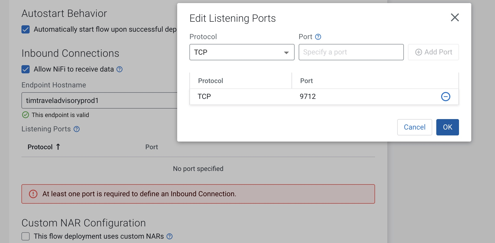
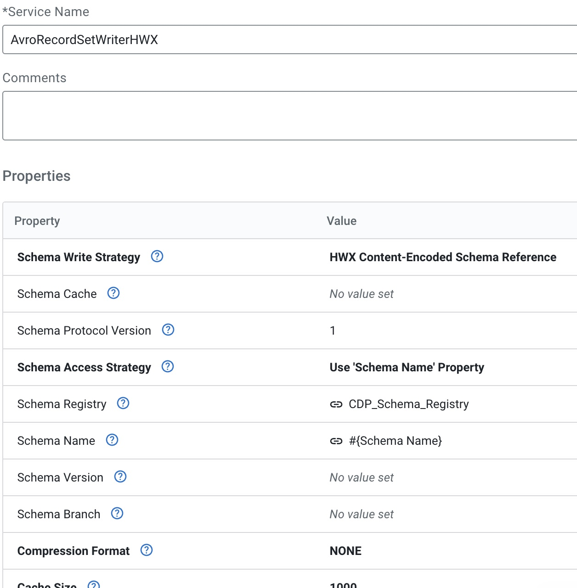
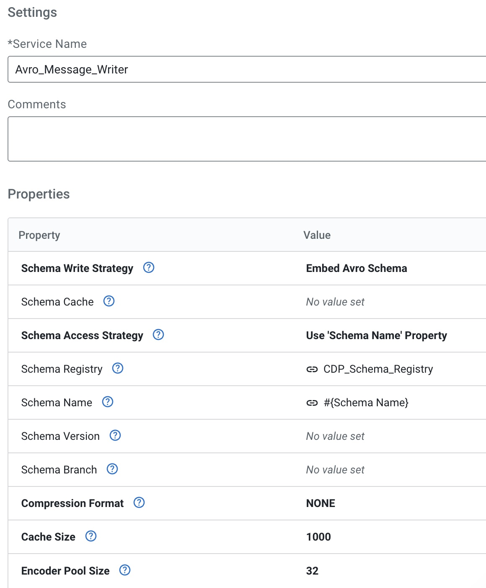
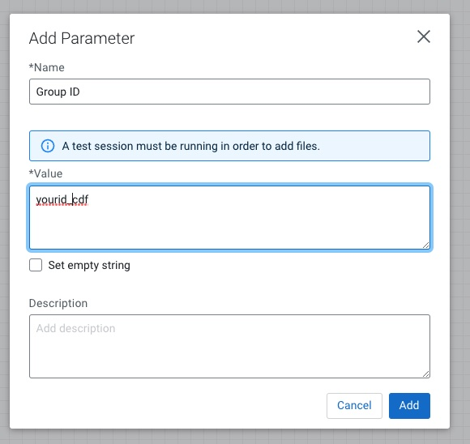
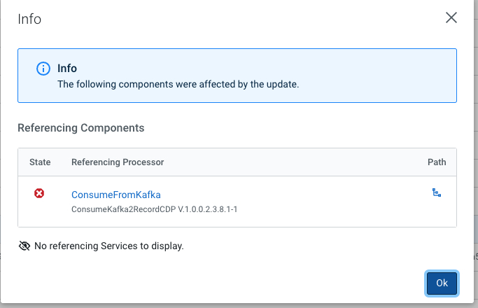
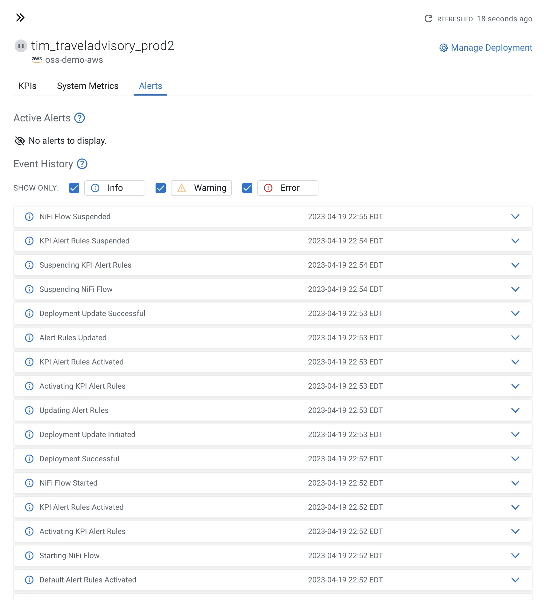
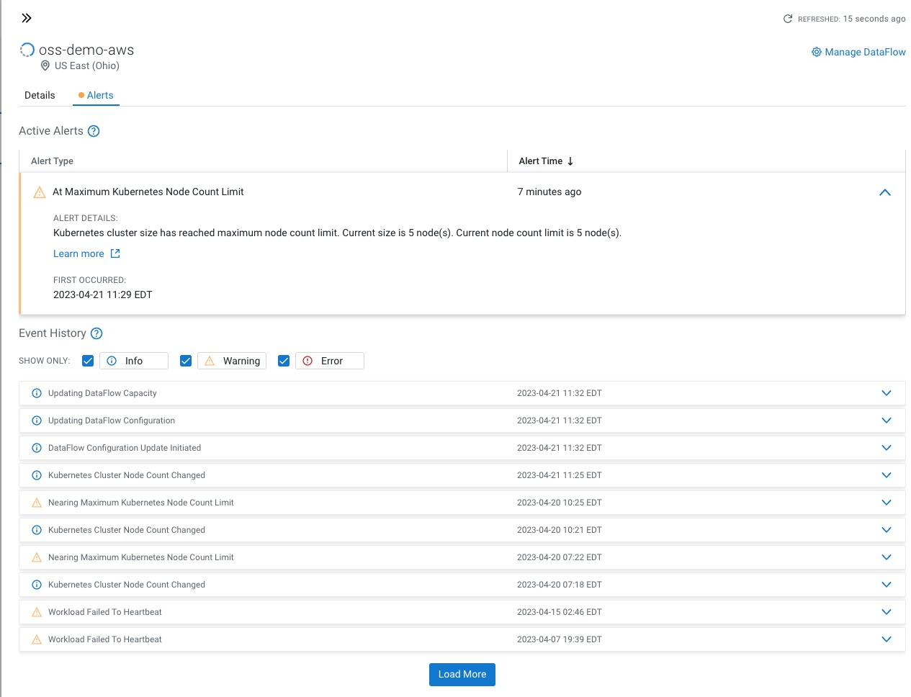
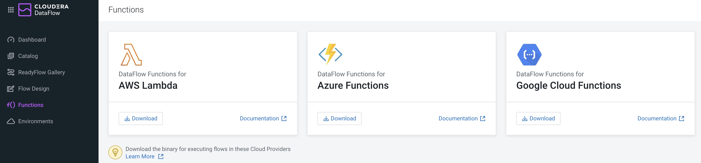

# FLaNK-TravelAdvisory
Travel Advisory - RSS Processing - Apache NiFi - Apache Kafka - Apache Flink - SQL

## Overview

## Final Flow

images/cloudflow/nififlow1.jpg

images/cloudflow/nififlow2.jpg

images/cloudflow/nififlow3.jpg

## Data Source

https://travel.state.gov/_res/rss/TAsTWs.xml

## CDF PC Data Hubs

images/cloudflow/datahubs.jpg

## Build Your Kafka Topic

images/cloudflow/datagensmm.jpg

images/cloudflow/createakafkatopic.jpg

## Navigate to DataFlow

images/cloudflow/homepage.jpg

## Cloudera Data Flow - Catalog

images/cloudflow/flowcatalog.jpg

images/cloudflow/flowcatalogdeploy.jpg

images/cloudflow/flowcatalogdeployordownload.jpg

images/cloudflow/flowdesigndrafts.jpg

## Build Your Flow in Cloudera DataFlow Designer

images/cloudflow/dashbord.jpg

images/cloudflow/configure.jpg

## Choose from the ReadyFlow Gallery to Speed Up Development

images/cloudflow/readyflowgallery.jpg

images/cloudflow/readyflowkafka.jpg

## Coding the Flow

images/cloudflow/invokeHTTP.jpg

images/cloudflow/queryrecord.jpg

images/cloudflow/rssxmlreader.jpg

images/cloudflow/evaluateJsonPath.jpg

images/cloudflow/publishToKafka.jpg

images/cloudflow/publishToKafkaDetails.jpg

## Setting Services

images/cloudflow/jsoninferreader.jpg

images/cloudflow/inferjsonreader.jpg

images/cloudflow/jsonrecordsetwriter.jpg

images/cloudflow/jsontreereaderschema.jpg

## Setting Parameters

images/cloudflow/parameters.jpg

## Test Session Run

images/cloudflow/dataviewer.jpg

## Publish A New Flow

images/cloudflow/publishfromdesigner.jpg

images/cloudflow/publishanewflow.jpg

## Publish a New Version of A Flow

images/cloudflow/publishnewversion.jpg
images/cloudflow/publishyourworkingflow.jpg

## Deploy Your Flow

images/cloudflow/newdeploymentstep1.jpg

images/cloudflow/newdeploymentsensitiveparameters.jpg

images/cloudflow/newdeploymentaddkpi.jpg

images/cloudflow/newdeploymentscaling.jpg

images/cloudflow/deploymentnameandenvironment.jpg

images/cloudflow/deployTravelAdvisory.jpg

images/cloudflow/deployment.jpg

images/cloudflow/deploymentparmsstep.jpg

images/cloudflow/builddeploycli.jpg

images/cloudflow/changenifiruntime.jpg

images/cloudflow/changeruntime.jpg

images/cloudflow/kpieditor.jpg

## Monitor Your Flow

images/cloudflow/deploymentstarted.jpg

images/cloudflow/deploymanager.jpg

images/cloudflow/deploymanager2.jpg

images/cloudflow/deploymanager3.jpg

images/cloudflow/deployedTravel.jpg

images/cloudflow/deploymentmanageractions.jpg

images/cloudflow/keyperind.jpg

images/cloudflow/runningprod.jpg

images/cloudflow/jvm.jpg

## Monitor K8 Environments

images/cloudflow/monitorenvironment.jpg

## DataFlow Functions for AWS Lambda, Azure Functions and Google Cloud Functions

## NiFi Flow Overview

## Example Video

https://www.youtube.com/watch?v=oF0BNByVAtI&ab_channel=DatainMotion

### Resourcces

* https://github.com/tspannhw/spring-pulsar-airquality/blob/da28de457642c7e8dd5aba815921e83a7b84e1f4/MOREDATA.md

* https://github.com/tspannhw/ApacheConAtHome2020/blob/879aafa276855a3fda3dcb19eb28c5c1f9cd9a53/docs/DailyMed/README.md

* https://github.com/tspannhw/clouddatawarehouse

* https://github.com/tspannhw/CloudDemo2021/tree/main/flows

* https://github.com/tspannhw/CloudStatus

* https://community.cloudera.com/t5/Community-Articles/Using-Cloudera-Flow-Management-To-Ingest-and-Process-RSS/ta-p/313074
