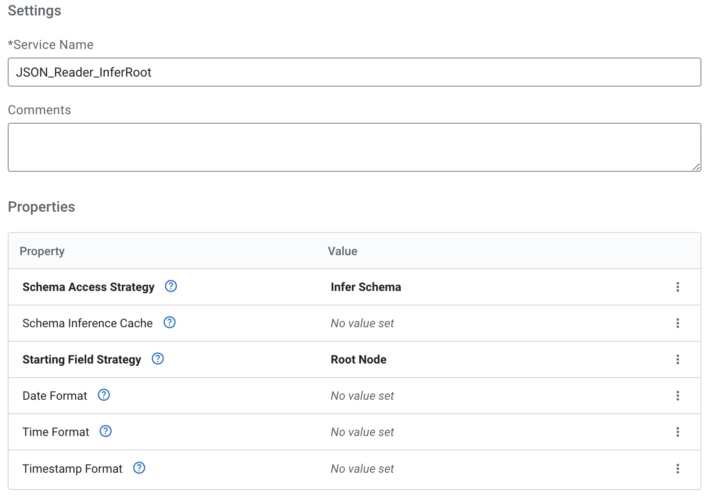
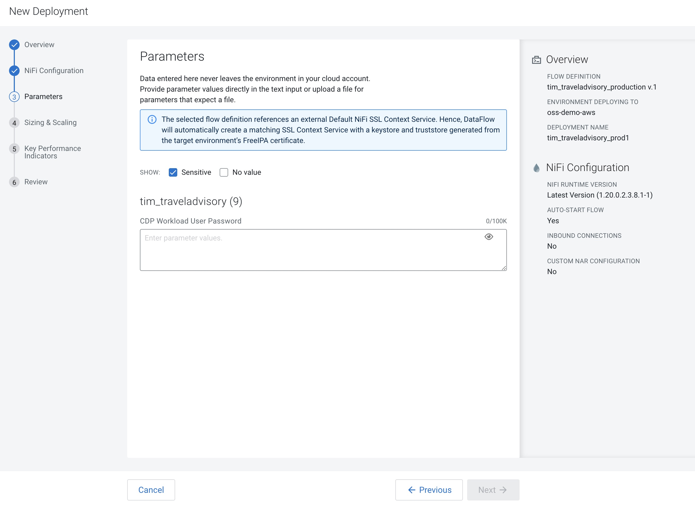
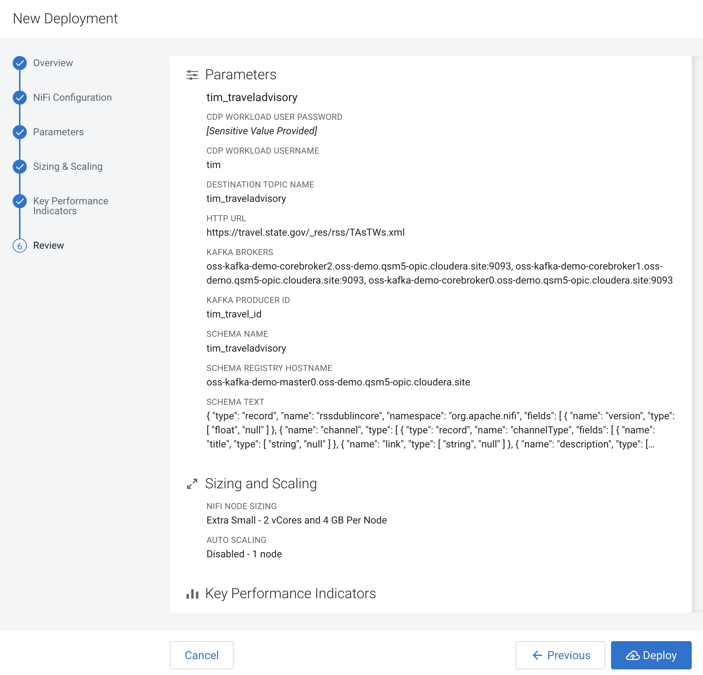

# FLaNK-TravelAdvisory

Travel Advisory - RSS Processing - Apache NiFi - Apache Kafka - Apache Flink - SQL

## Overview

##  Video Walk Through

https://www.youtube.com/watch?v=-r8zf_nfxCw&ab_channel=DatainMotion

## Final Flow

## Data Source

https://travel.state.gov/_res/rss/TAsTWs.xml

## CDF PC Data Hubs

## Set Your Workload Password for Security

## Build Your Kafka Topic

## Navigate to DataFlow

## Cloudera Data Flow - Catalog

## Build Your Flow in Cloudera DataFlow Designer

For a step-by-step flow walkthrough, see https://github.com/tspannhw/FLaNK-TravelAdvisory/blob/main/steps.md

## Choose from the ReadyFlow Gallery to Speed Up Development

## Coding the Flow

## Setting Services

## Setting Parameters

## Test Session Run

## Publish A New Flow

## Publish a New Version of A Flow

## Deploy Your Flow

## Monitor Your Flow

## Monitor K8 Environments

## NiFi Flow Overview

## SQL Stream Builder (Apache Flink SQL)

## Example Video

https://www.youtube.com/watch?v=oF0BNByVAtI&ab_channel=DatainMotion

### Resourcces

* https://github.com/tspannhw/spring-pulsar-airquality/blob/da28de457642c7e8dd5aba815921e83a7b84e1f4/MOREDATA.md

* https://github.com/tspannhw/ApacheConAtHome2020/blob/879aafa276855a3fda3dcb19eb28c5c1f9cd9a53/docs/DailyMed/README.md

* https://github.com/tspannhw/clouddatawarehouse

* https://github.com/tspannhw/CloudDemo2021/tree/main/flows

* https://github.com/tspannhw/CloudStatus

* https://community.cloudera.com/t5/Community-Articles/Using-Cloudera-Flow-Management-To-Ingest-and-Process-RSS/ta-p/313074

copyright 2023.   Tim Spann.  
