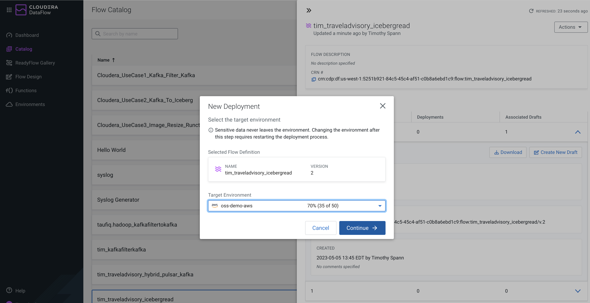
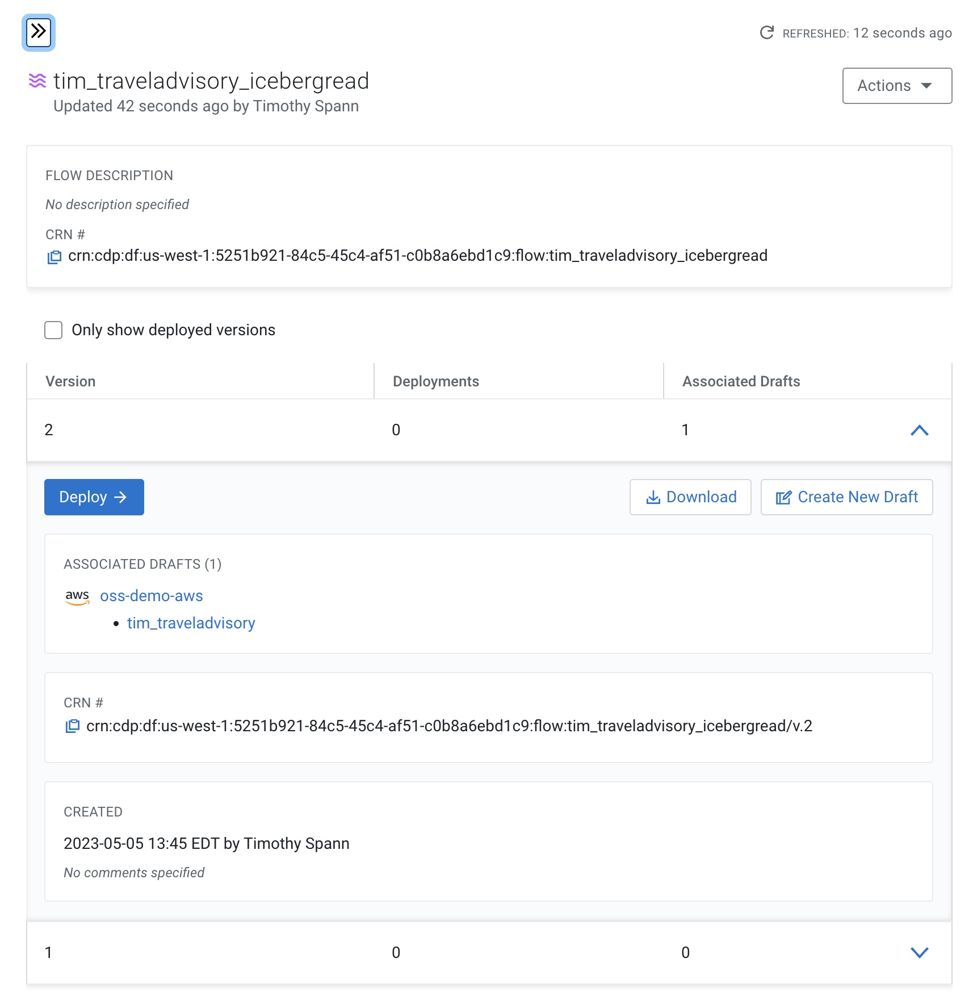
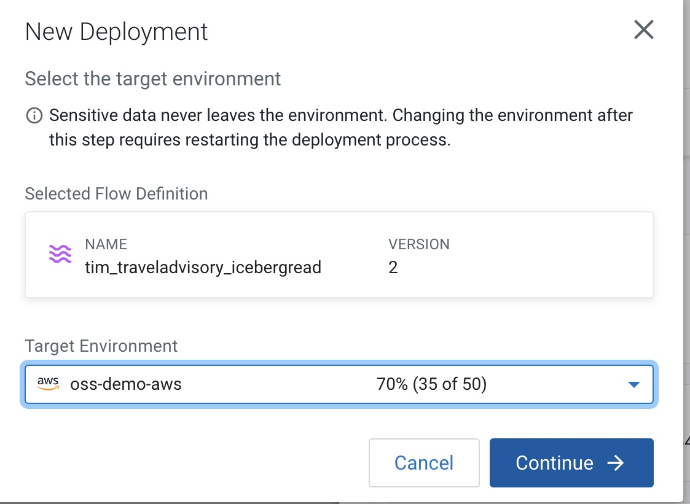
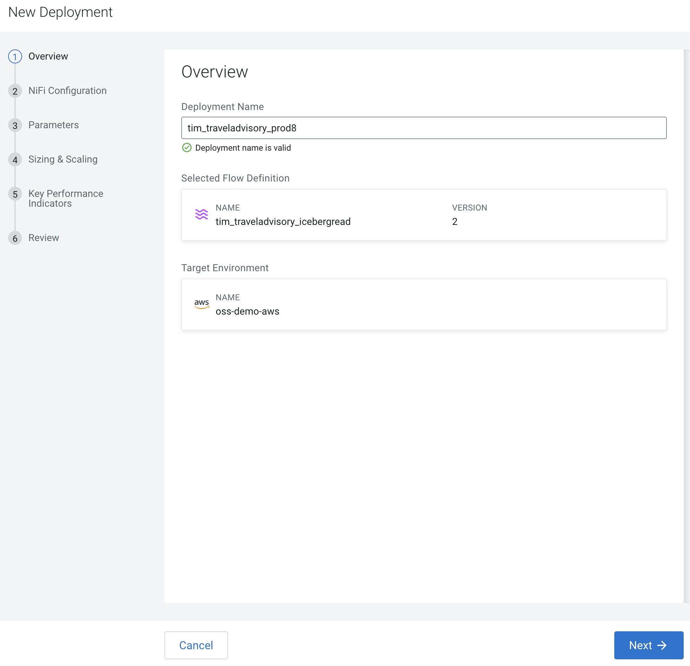
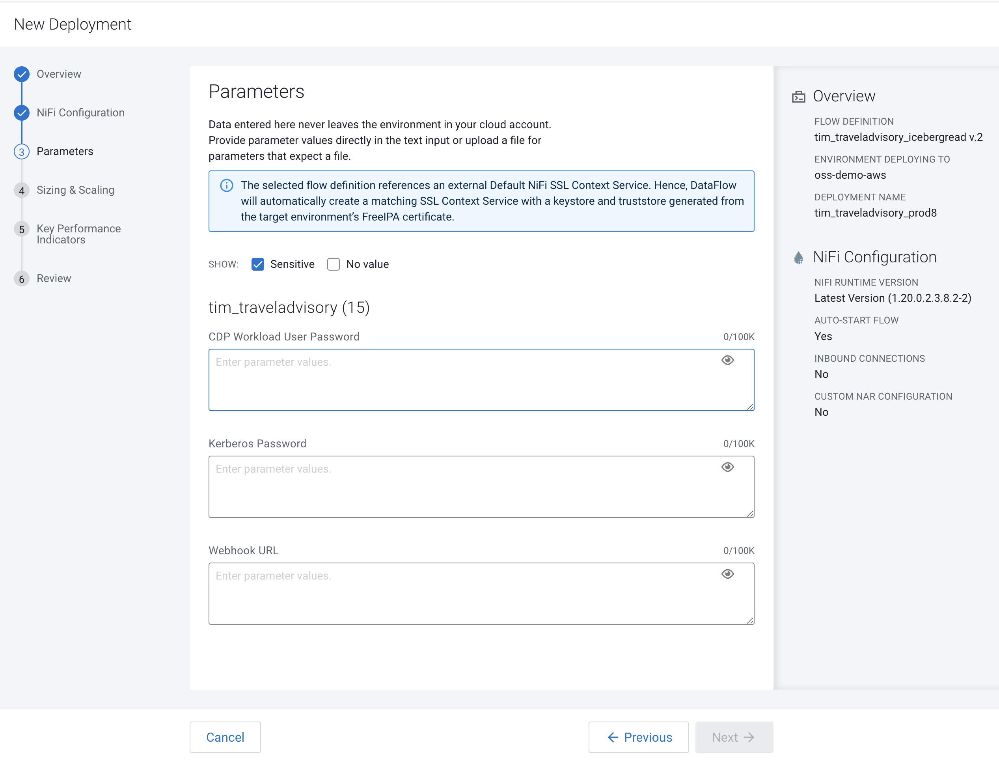
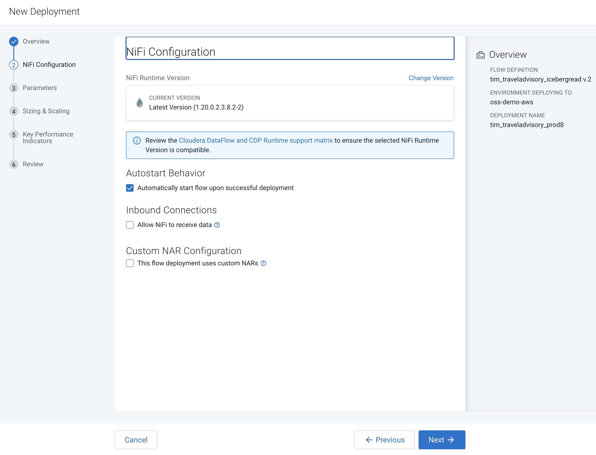
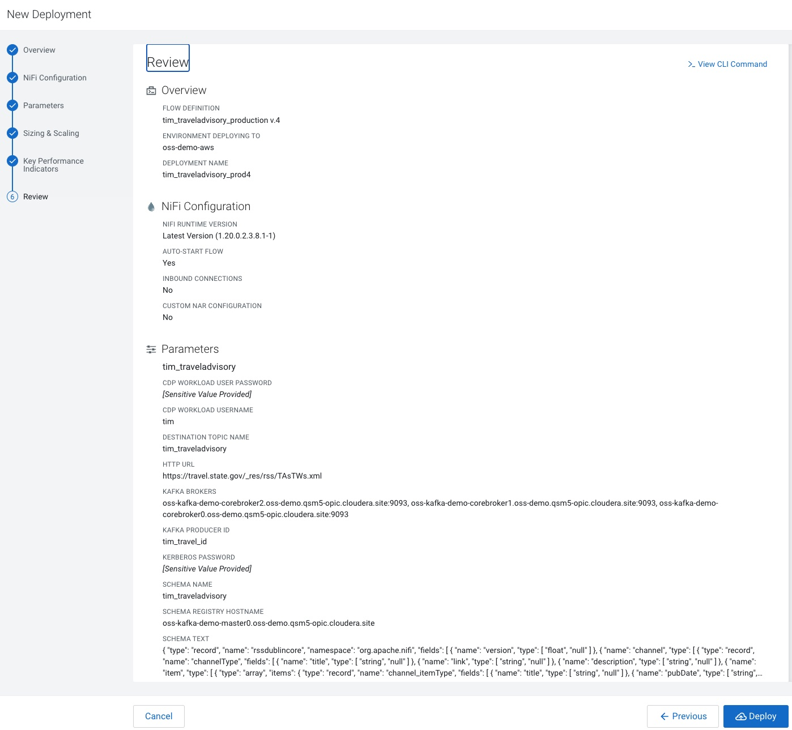

### Deploy to the Public Cloud and Kubernetes

### Video to Deploy

https://www.youtube.com/watch?v=biKribaFD_s&ab_channel=DatainMotion

## Step-by-Step Deploy

Parameters

Configuration

Review Deployment

### Deployment Code

See:  deploy/tim_traveladvisory_icebergread-version-4.json

### Parameters

See: deploy/tim_traveladvisory_prod14-parameter-groups.json

### KPI

See: deploy/tim_traveladvisory_prod14-kpis.json

### Reference Documentation

* https://docs.cloudera.com/dataflow/cloud/manage-environment/topics/cdf-manage-environment.html
* https://docs.cloudera.com/dataflow/cloud/about-readyflows.html
* https://docs.cloudera.com/dataflow/cloud/develop-flow-definitions/topics/cdf-flow-isolation.html
* https://docs.cloudera.com/dataflow/cloud/flow-designer-manage-flow/topics/cdf-flow-designer-publish-to-catalog.html
* https://docs.cloudera.com/dataflow/cloud/flow-designer-manage-flow/topics/cdf-flow-designer-publish-version.html
* https://docs.cloudera.com/dataflow/cloud/flow-designer-test-sessions/topics/cdf-flow-designer-start-test-session.html

### Reference Videos

* https://www.youtube.com/watch?v=4LlWIO5AAWc
* https://www.youtube.com/watch?v=duHHMZrXxtY
* https://www.youtube.com/watch?v=p9-Y1PRYDn4&t=123s
* https://www.youtube.com/watch?v=z9gsFuun5GA&t=358s
* https://www.youtube.com/watch?v=-r8zf_nfxCw&t=2s
