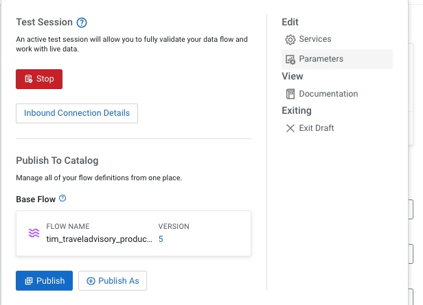
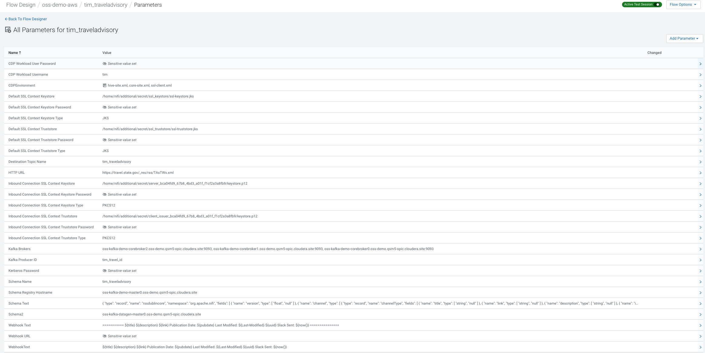
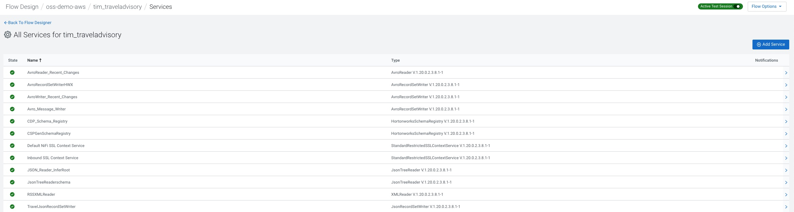

# FLaNK-TravelAdvisory

Travel Advisory - RSS Processing - Apache NiFi - Apache Kafka - Apache Flink - SQL


## Overview


## Final Flow


## Adding Processors to the Designer

Here I list most of the processors available

https://www.datainmotion.dev/2023/04/dataflow-processors.html


## Flow Parameters

Go to parameters and enter all you will need for the flow.





You can add all the ones listed below.




## Flow Walk Through

If you are loading my pre-built flow when you enter you will see the details for the process group in the configuration pallet.

We add an invokeHTTP processor and set the parameters.


Now we can add a parameter for the HTTP URL for Travel Advisories.


Connect InvokeHTTP to QueryRecord.   Name your connection for monitoring later.


QueryRecord, convert XML(RSS) to JSON, you will need RSSXMLReader and TravelJsonRecordSetWriter.


Connect QueryRecord to SplitJson if no errors.


SplitJson we set the JsonPath Expression to ```` $.*.*.item ````


We then connect SplitJson to SplitRecord.


For SplitRecord we set the Record Reader to JSON_Reader_InferRoot, the Record Writer to TravelJsonRecordSetWriter and records per split to 1.


SplitRecord connected to EvaluateJSONPath


We set the Destination to flowfile-attribute, Return Type to json and add several new fields.

* description  - $.description
* guid - $.guid
* identifier - $.identifier
* link - $.link
* pubdate - $.pubDate
* title - $.title


We connect EvaluateJsonPath to SplitJson.


For SplitJson we set the JsonPath Expression to $.category


From SplitJson to UpdateRecord


In UpdateRecord, we set Record Reader to JSON_Reader_InferRoot and Record Writer to TravelJsonRecordSetWriter.   We set Replacement Value Strategy to Literal Value.

We add new fields for our new record format.

* /advisoryId - ${filename}
* /description - ${description}
* /domain - ${identifier:trim()}
* /guid - ${guid}
* /link - ${link}
* /pubdate - ${pubdate}
* /title - ${title}
* /ts - ${now():toNumber()}
* /uuid - ${uuid} 


Next we connect UpdateRecord to our Slack Sub-Processor Group


The other branches flows from UpdateRecord to Write to Kafka


For PublishKafka2RecordCDP, there's a lot of parameters to set.  This is why we recommend starting with a ReadyFlow.

There are a lot of parameters here, we need to set our Kafka Brokers, Destination Topic Name, JSON_Reader_InferRoot for Reader, AvroRecordSetWriterHWX for writer,
turn transactions off, Guarantee Replicated Delivery, Use Content as Record Value, SASL_SSL/Plain security, Username to your login user id or machine user and then the associated password,
the SSL Context maps to the Default NiFi SSL Context Service is built in, set uuid as the Message Key Field and finally set the client.id to a unique Kafka producer id.


We then send messages also to Slack about our travel advisories.


We only need one processor to send to slack.


We connect input to our PutSlack processor.


For PutSlack we need to set the Webhook URL to the one from your Slack group admin and put the text from the ingest, set your channel to the channel mapped in the web hook and set a username for your bot.


## Flow Services



All these services need to be set.


@copy; 2023 Tim Spann https://datainmotion.dev/
