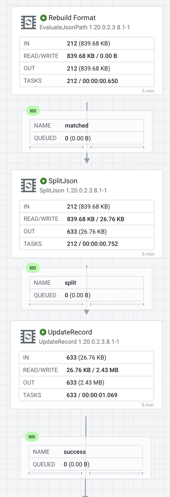
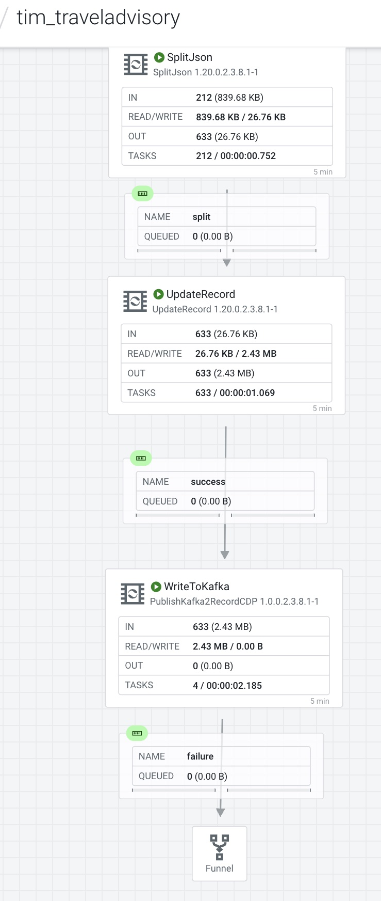
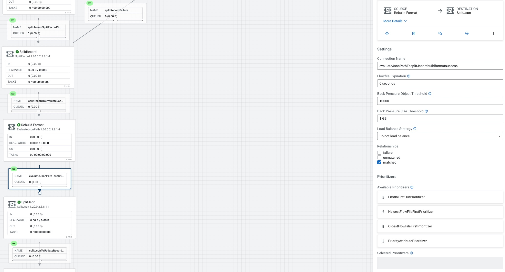

# FLaNK-TravelAdvisory

Travel Advisory - RSS Processing - Apache NiFi - Apache Kafka - Apache Flink - SQL

## Overview

## Final Flow

## Flow Walk Through

@copy; 2023 Tim Spann https://datainmotion.dev/
